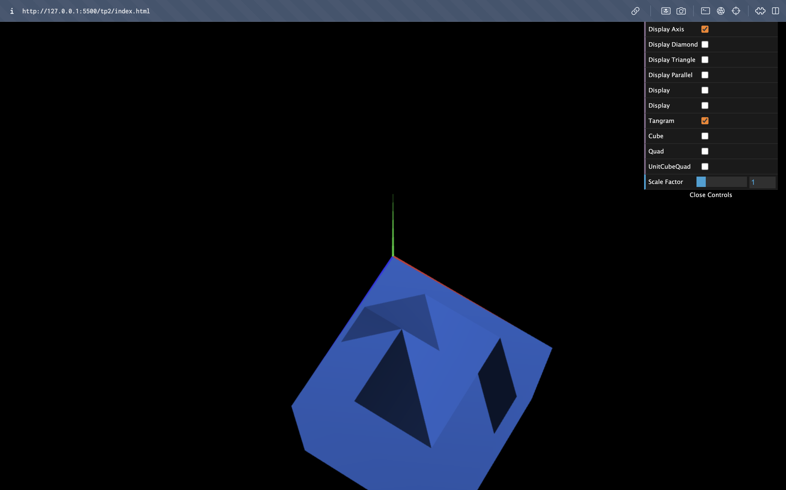

# CG 2023/2024

## Group T09G10

## TP 2 Notes

- In this first exercise, we found some issues with how the matrixes work, and how to properly place our images in the right position, with either rotation or translation. But we quickly understood, and it was easy to do the rest of the Pangram pieces. Another issue was how to call multiple objects to build the Pangram, not a very difficult problem to overcome.

- In the second exercise, we had some difficulties in finding the correct order to do all of the transformations to get the intended result.

- In the third exercise, we didn't find any difficulties, since building the Unit Cube Quad was very similar to the Tangram by calling several objects (MyCube) to build the full image.

