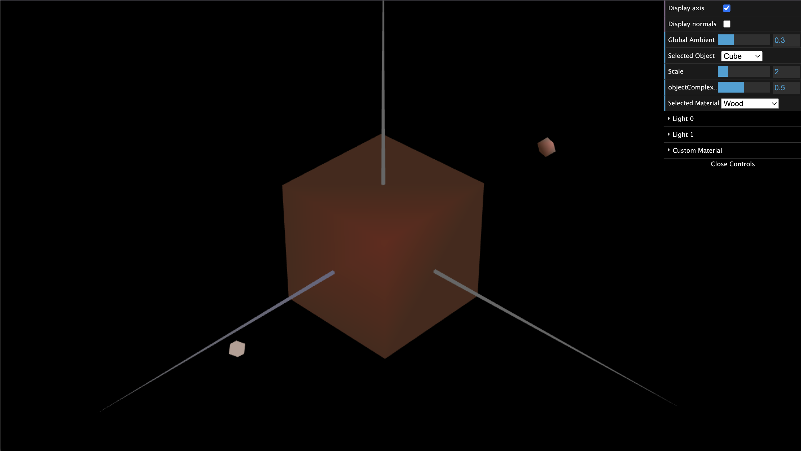
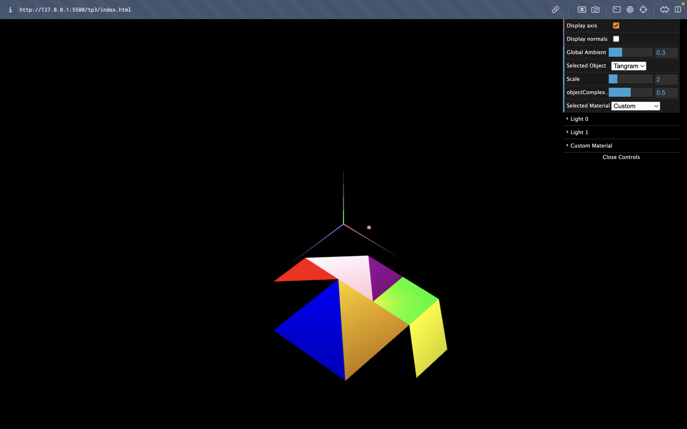
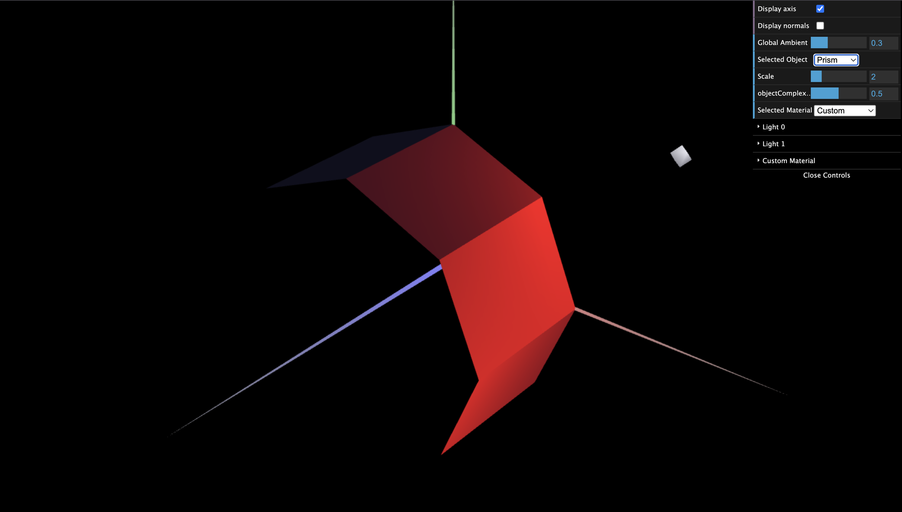
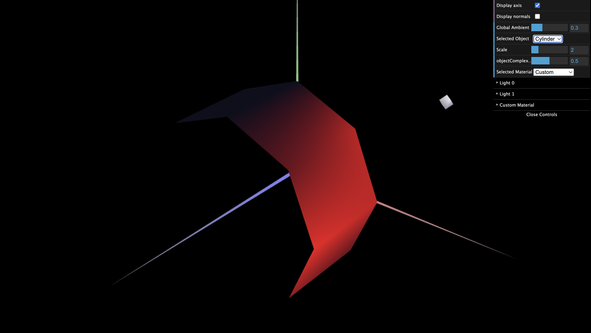

# CG 2023/2024

## Group T09G10

## TP 3 Notes

- For exercise 1, the Cube part, we had some difficulty understanding how the normals worked, and how to create the material similar to wood, specifically how the values in setAmbient(), setDiffuse(), and setSpecular() functioned. We also had some issues in displaying the tangram at the front and back and with displaying the correct colors.

- For exercise 2, we had difficulties in finding the right calculations for the vertices, indices and normals.

- For exercise 3, we did not find any difficulties, all we had to do was take the prism and simplify the normals.

