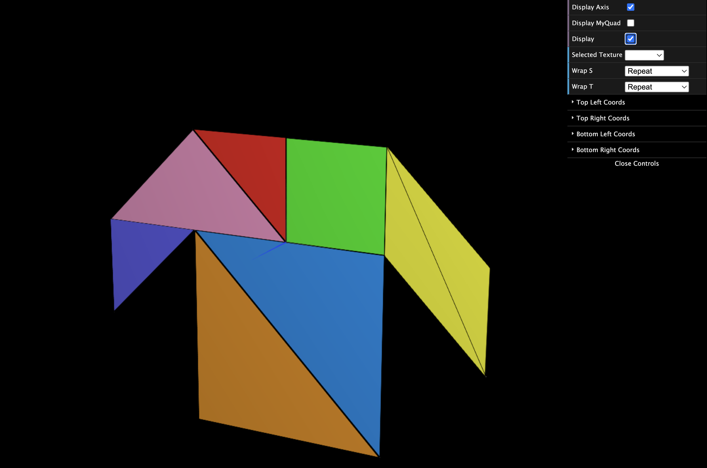

# CG 2023/2024

## Group T09G10

## TP 4 Notes

- We found some difficulties trying to understand how to apply the texture to the pangram image, but once we understood how it was simple.

- When applying the texture to the cube we found some difficulties with the positioning of the textures and understanding how the constructor of the cube should be changed.

